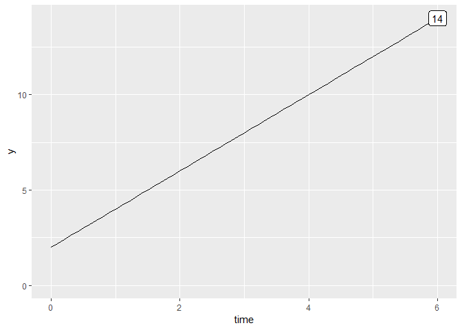
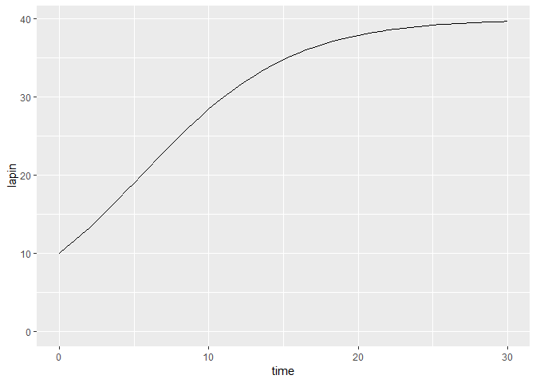
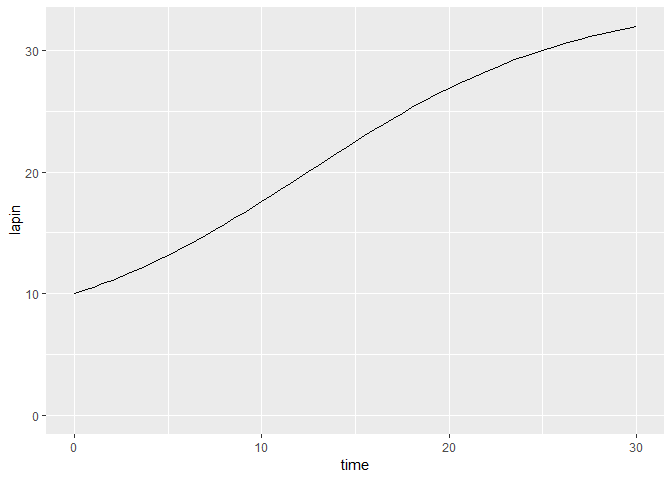
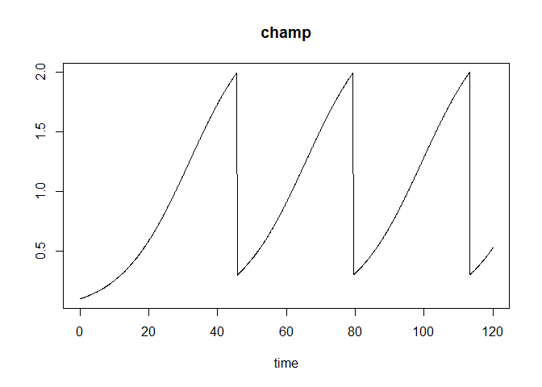
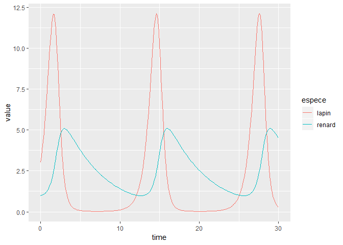
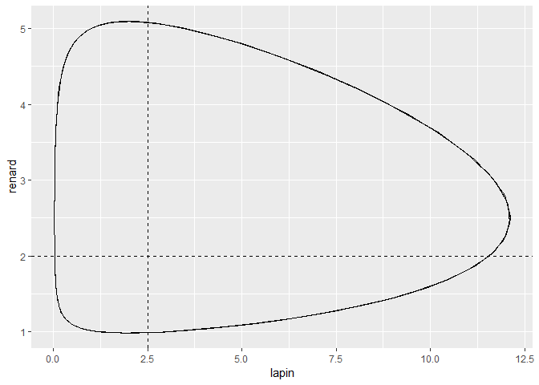
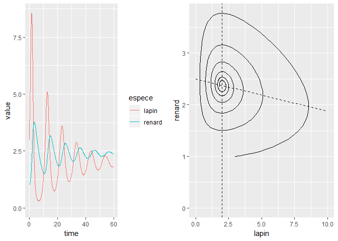
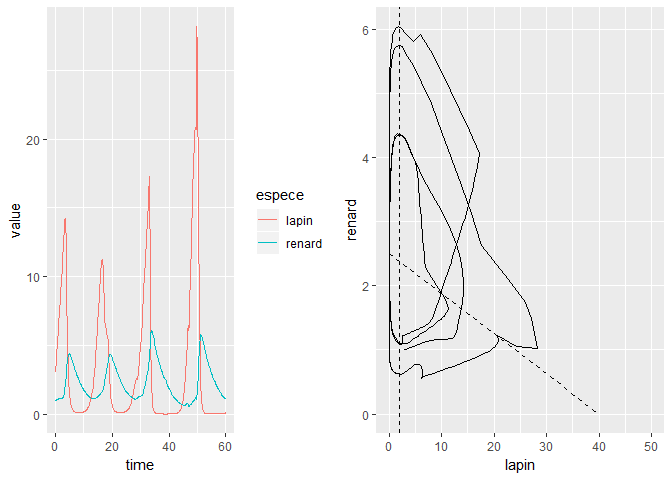

Modélisation déterministe
================
Serge-Étienne Parent
2019-04-16

# Modélisation déterministe

-----

️ **Objectifs spécifiques**:

À la fin de ce chapitre, vous

  - saurez définir une équation différentielle ordinaire et une équation
    différentielle partielle
  - saurez aptes à détecter un problème impliquant le besoin d’utiliser
    des équations différentielles
  - serez en mesure d’effectuer une modélisation impliquant un système
    d’EDO en contexte écologique

De plus, en extra (non évalué, objectif incertain), vous - serez en
mesure d’effectuer une modélisation par différences finies impliquant
une EDP simple en contexte écologique

-----

On se réfère à la modélisation mécanistique lorsque des principes
théoriques guident une modélisation, à l’inverse de la modélisation
phénoménologique, qui est guidée par les données. Il existe de
nombreuses techniques de modélisation mécanistique, mais la plupart sont
guidées par les équations différentielles.

## Équations différentielles

Les équations différentielles permettent la résolution de problèmes
impliquant des gradients dans le temps et dans l’espace. On les utilise
pour modéliser la dynamique des populations, la thermodynamique,
l’écoulement de l’eau dans les sols, le transport des solutés, etc.
On en distingue deux grandes catégories: les équations différentielles
ordinaires et partielles.

**Équations différentielles ordinaires (EDO)**. Les équations
différentielles ordinaires s’appliquent sur des fonctions s’appliquant
à une seule variables, qui est souvent le temps. On pourra suivre, par
exemple, l’évolution de la température en un point, en fonction du temps
à partir d’une condition initiale. Parfois, plusieurs EDO sont utilisées
conjointement pour créer un système d’EDO que l’on pourra nommé un
*système dynamique*. Les solutions analytiques des EDO sont parfois
relativement faciles à résoudre, mais les ordinateurs permettent des
résolutions numériques en quelques lignes de code.

**Équations différentielles partielles (EDP)**. Dans ce cas, ce sont
plusieurs variables qui sont différenciées dans la même fonction. Il
peut s’agir des coordonnées dans l’espace \([x, y, z]\) (régime
permanent), qui peuvent aussi être appliqués à différents pas de temps
(régime transitoire). Le problème sera délimité non pas seulement par
des conditions initiales, mais aussi par des conditions aux frontières
du modèle. Puisque que les solutions analytiques des EDP peuvent
rarement être développées, on utilisera pratiquement toujours des
approches numériques que sont principalement les méthodes de résolution
par différences finies ou par éléments finis.

## Les équations différentielles ordinaires en modélisation écologique

L’évolution des populations dans le temps peut être abordée à l’aide de
systèmes d’équations différentielles. Une simple équation décrivant la
croissance d’une population peut être couplée à des schémas
d’exploitation de cette population, que ce soit une exploitation
forestière, une terre fourragère ou un territoire de chasse. On pourra
aussi faire interagir des populations dans des schémas de relations
biologiques. Ces processus peuvent être implémentés avec des processus
aléatoires pour générer des schémas probabilistes. De plus, les
biostatistiques et l’autoapprentissage peuvent être mis à contribution
afin de calibrer les modèles.

### Évolution d’une seule population en fonction du temps

La croissance d’une population (ou de sa densité) isolée en fonction du
temps dépend des conditions qui lui offre son environnement. Dans le cas
de la biomasse d’une culture à croissance constante, le taux de
croissance est toujours le
    même.

\[ \frac{d 🌿 }{dt} = c \]

\[ \int_0^t c dt = \int_{🌿_0}^{🌿(t)} ~d🌿 \]

\[ ct = 🌿(t) - 🌿_0\]

\[ 🌿(t) = 🌿_0 + ct \]

``` r
library("tidyverse")
```

    ## -- Attaching packages ----------------------------------------------------------------------------- tidyverse 1.2.1 --

    ## v ggplot2 3.1.1       v purrr   0.3.2  
    ## v tibble  2.1.1       v dplyr   0.8.0.1
    ## v tidyr   0.8.3       v stringr 1.4.0  
    ## v readr   1.3.1       v forcats 0.4.0

    ## -- Conflicts -------------------------------------------------------------------------------- tidyverse_conflicts() --
    ## x dplyr::filter() masks stats::filter()
    ## x dplyr::lag()    masks stats::lag()

``` r
y0 <- 2
c <- 2 # exprimé en individu / pas de temps
time <- seq(0, 6, 0.1)
y <- y0 + c * time
tibble(time, y) %>% 
  ggplot(aes(x = time, y = y)) +
  geom_line() +
  geom_label(x = max(time), y = max(y), label = round(max(y))) +
  expand_limits(y = 0)
```

<!-- -->

Dans le cas d’une population qui se reproduit, une formulation simple
modélise une évolution linéaire associée à un taux de natalité \(n\) et
un taux de mortalité \(m\), où \(r = n-m\) est le taux de croissance de
la population d’une population de lapins 🐰 en fonction du temps \(t\).

\[ \frac{d🐰}{dt} = n🐰 - m🐰 = r🐰 \]

\[ \int_0^t dt = \int_{🐰_0}^{🐰(t)} \frac{1}{r🐰} ~d🐰 \]

\[ t = \frac{1}{r} ln(🐰) \bigg\rvert_{🐰_0}^{🐰(t)} \]

\[ rt = ln \left( \frac{🐰(t)}{🐰_0} \right) \]

\[ 🐰(t) = 🐰_0 exp(rt) \]

La vitesse de croissance est constante pour une population constante,
mais la croissance de la population est exponentielle étant donnée que
chaque nouvel individu se reproduit.

``` r
y0 <- 10
r <- 0.2 # exprimé en individu / pas de temps
time <- seq(0, 10, 0.1)
y <- y0 * exp(r*time)
tibble(time, y) %>% 
  ggplot(aes(x = time, y = y)) +
  geom_line() +
  geom_label(x = max(time), y = max(y), label = round(max(y))) +
  expand_limits(y = 0)
```

<!-- -->

De 10 lapins au départ, nous en avons un peu plus de 75 après 10 ans… et
près de 5 milliards après 100 ans\! En fait, la capacité de support
d’une population étant généralement limitée, on peut supposer que le
taux de natalité décroit et que le taux de mortalité croit linéairement
avec l’effectif.

\[ n(🐰) = \alpha - \beta 🐰 \] \[ m(🐰) = \gamma + \delta 🐰 \]

On aura
donc

\[ \frac{d🐰}{dt} = 🐰 \left( \alpha - \beta 🐰 \right) - 🐰 \left( \gamma + \delta 🐰 \right) = r🐰 \left( 1 - \frac{🐰}{K} \right) \]

où \(r = \alpha - \gamma\) est l’ordonnée à l’origine du taux de
croissance (théorique, lorsque la population est nulle) et
\(K = \frac{\alpha-\gamma}{\beta + \delta}\) est la capacité limite du
milieu de subsistance. On pourra s’aider d’un logiciel de calcul
symbolique comme `sympy` ou
[`maxima`](https://andrejv.github.io/wxmaxima/) pour en tirer une
solution analytique. Mais à ce point, nous utiliserons une approximation
numérique. Nous utiliserons le module `deSolve`.

``` r
library("deSolve")
```

`deSolve` demande de définir les paramètres de l’EDO ou du système
d’EDO. Nous devons d’abord spécifier à quels pas de temps notre EDO
doit être approximée. J’étends la plage de temps à 30 ans pour bien
visualiser la courbe de croissance.

``` r
time <- seq(0, 30, by = 0.5)
```

Les conditions initiales du système d’EDO sont aussi définies dans un
vecteur. La seule condition initiale de notre EDO est le nombre initial
de lapin.

``` r
y0 <- c(lapin = 10)
```

On définira les paramètres dans un vecteur `p`. Dans notre cas, nous
avons \(r\), le taux de croissance à l’origine et \(K\), la capacité de
support de l’écosystème. Il est préférable de nommer les paramètres du
vecteur pour éviter les erreurs.

``` r
p <- c(r = 0.2, K = 40)
```

Enfin, une fonction définit l’EDO avec, comme entrées, les pas de temps,
les conditions initiales et les paramètres. La sortie de la fonction est
un vecteur des dérivées emboîtés dans une liste (lisez le fichier d’aide
de la fonction `ode` pour les détails en lançant `?ode`).

``` r
model_logistic <- function(t, y, p) {
  lapin <- y[1]
  dlapin_dt <- p[1] * lapin * (1 - lapin/p[2])
  return(list(c(dlapin_dt)))
}
```

Une fois que les pas de temps, les conditions initiales, les paramètres
et le modèle sont définis, on les spécifie comme arguments dans la
fonction `ode`. La sortie de la fonction `ode` est une matrice dont la
première colonne comprend les pas de temps imposés, et les autres
colonnes sont les dérivées spécifiées à la sortie de la fonction `ode`.

``` r
lapin_t <- ode(y = y0, times = time, model_logistic, p)
lapin_t 
```

    ##    time    lapin
    ## 1   0.0 10.00000
    ## 2   0.5 10.76856
    ## 3   1.0 11.57342
    ## 4   1.5 12.41288
    ## 5   2.0 13.28478
    ## 6   2.5 14.18643
    ## 7   3.0 15.11466
    ## 8   3.5 16.06582
    ## 9   4.0 17.03586
    ## 10  4.5 18.02037
    ## 11  5.0 19.01466
    ## 12  5.5 20.01386
    ## 13  6.0 21.01300
    ## 14  6.5 22.00708
    ## 15  7.0 22.99125
    ## 16  7.5 23.96083
    ## 17  8.0 24.91140
    ## 18  8.5 25.83894
    ## 19  9.0 26.73980
    ## 20  9.5 27.61084
    ## 21 10.0 28.44937
    ## 22 10.5 29.25324
    ## 23 11.0 30.02079
    ## 24 11.5 30.75085
    ## 25 12.0 31.44273
    ## 26 12.5 32.09615
    ## 27 13.0 32.71124
    ## 28 13.5 33.28848
    ## 29 14.0 33.82863
    ## 30 14.5 34.33270
    ## 31 15.0 34.80193
    ## 32 15.5 35.23770
    ## 33 16.0 35.64151
    ## 34 16.5 36.01496
    ## 35 17.0 36.35967
    ## 36 17.5 36.67732
    ## 37 18.0 36.96956
    ## 38 18.5 37.23803
    ## 39 19.0 37.48434
    ## 40 19.5 37.71003
    ## 41 20.0 37.91660
    ## 42 20.5 38.10547
    ## 43 21.0 38.27800
    ## 44 21.5 38.43546
    ## 45 22.0 38.57905
    ## 46 22.5 38.70991
    ## 47 23.0 38.82909
    ## 48 23.5 38.93755
    ## 49 24.0 39.03622
    ## 50 24.5 39.12594
    ## 51 25.0 39.20747
    ## 52 25.5 39.28153
    ## 53 26.0 39.34879
    ## 54 26.5 39.40985
    ## 55 27.0 39.46526
    ## 56 27.5 39.51553
    ## 57 28.0 39.56112
    ## 58 28.5 39.60247
    ## 59 29.0 39.63996
    ## 60 29.5 39.67395
    ## 61 30.0 39.70474

``` r
lapin_t %>% 
  as_tibble() %>% 
  ggplot(aes(x = time, y = lapin)) +
  geom_line() +
  expand_limits(y = 0)
```

<!-- -->

**Exercice**. Que ce passerait-il si le taux de croissance était
négatif? Profitez-en pour changer les paramètres `r` et `K`.

**Exercice**. D’autres formulations existent pour exprimer des taux de
croissance (Gompertz, Allee, etc.). En outre la formulation de Gompertz
s’écrit comme suit.

\[ \frac{d🐰}{dt} = r🐰 \left( ln \frac{K}{🐰} \right) \]

Entrer cet EDO dans `R` avec `deSolve`.

### Population exploitée

L’exploitation d’une population peut être effectuée de différentes
manières. D’abord, le prélèvement peut être effectué de manière
constante, par exemple dans un élevage ou par la chasse ou la
cueillette. Ajoutons un prélèvement constant dans une courbe de
croissance logistique.

\[ \frac{d🐰}{dt} = r🐰 \left( 1 - \frac{🐰}{K} \right) - Q \]

où \(Q\) est le quota, ou le prélèvement constant.

On pourra aussi effectuer un prélèvement proportionnel à la population.

\[ \frac{d🐰}{dt} = r🐰 \left( 1 - \frac{🐰}{K} \right) - E🐰 \]

où \(E\) est l’effort d’exploitation.

Ou bien effectuer une série de prélèvement ponctuels, comme la récolte
de plantes
fourragères.

\[ \frac{d🌿}{dt} = c - \left[ 🌿 - \gamma \right] \bigg\rvert_{t=a, b, c, d, e, ...} \]

où \(\gamma\) est le reste de la biomasse après la récolte et
\(t=a, b, c, d, e, ...\) sont les pas de temps où le bloc entre les
crochets est actif, c’est-à-dire la période de récolte. La solution
analytique d’une culture à croissance constante est plutôt facile à
déduire.

Les fonctions de prélèvement peuvent être modulées à votre guise.

Prenons pour l’exemple un prélèvement constant et une croissance
logistique.

``` r
p <- c(r = 0.2, K = 40, Q = 1)

model_logistic_expl <- function(t, y, p) {
  lapin <- y[1]
  dlapin_dt <- p[1] * lapin * (1 - lapin/p[2]) - p[3]
  return(list(c(dlapin_dt)))
}

lapin_t <- ode(y = y0, times = time, model_logistic_expl, p)
lapin_t %>% 
  as_tibble() %>% 
  ggplot(aes(x = time, y = lapin)) +
  geom_line() +
  expand_limits(y = 0)
```

<!-- -->

**Exercice**. Modéliser avec un prélèvement proportionnel.
Qu’arrive-t-il lorsque le prélèvement est trop élevé?

L’**exploitation ponctuelle**, comme la récolte ou l’administration
d’une série de traitements, implique l’utilisation d’approches
intermittentes. Bien que `deSolve` ignore les changements dans les
variables d’état (`y`) tels que définis dans les dérivés, nous pouvons
avoir recours à des *évènements* dans le jargon de `deSolve`. Ces
évènements doivent être spécifiés dans un `data.frame` ou une liste.
Il est difficile de trouver un exemple générique pour modéliser des
évènements. Pour en savoir davantage, je vous invite donc à consulter
la fiche d’aide `?events`.

Dans notre cas, nous allons modéliser une récolte de plantes
fourragères. La récolte est déclenchée lorsque le rendement atteint 2
t/ha, et laisser 0.3 t/ha au sol pour assurer le renouvellement pour les
coupes subséquentes. Définissons d’abord les entrées du modèles.

``` r
time <- seq(0, 120, 0.1)
p <- c(r = 0.1, K = 2.5)
y0 <- c(champ = 0.1)
```

Nous devons définir une fonction *root* (racine), comprenant tous les
arguments de la fonction d’EDO, dont la sortie est une valeur qui
déclenchera un évènement lorsque la valeur sera nulle. Dans notre cas,
la valeur correspond simplement au rendement moins 2, la quantité au
champ y\[1\]. Notez que d’autres stratégies peuvent être utilisées pour
déclencher une récolte, par exemple le pourcentage de floraison qui
demanderait des simulations plus poussées.

``` r
recolte_root <- function(t, y, p) y[1]-2
```

Puis, lorsque la fonction root est déclenchée, l’évènement ramène la
quantité au champs à 0.3 t/ha, une quantité qui permet de relancer la
croissance.

``` r
recolte_event <- function(t, y, p) {
  y[1] <- 0.3
  return(y)
}
```

La fonction du modèle est telle qu’utilisée auparavant: une fonction
logistique.

``` r
recolte <- function(t, y, p) {
  champ <- y[1]
  dchamp_dt <- p[1] * champ * (1 - champ/p[2])
  return(list(c(dchamp_dt)))
}
```

La fonction `ode` est lancée en entrant les fonction `root` et `events`.

``` r
out <- ode(times = time, y = y0, func = recolte, parms = p,
           rootfun = recolte_root,
           events = list(func = recolte_event, root = TRUE),
           method="impAdams")
plot(out)
```

<!-- -->

Nous pourrons organiser deux récoltes de 1.7 t/ha et une de 2 t/ha pour
terminer la saison.

**Exercice**. Qu’adviendrait-il si vous laissiez 0.15 t/ha au champ au
lieu de 0.3? Ou si vous laissiez 1 t/ha? Ou si vous déclenchiez une
récolte à 2.3 t/ha?

**Défi**. Pouvez-vous modéliser l’ensilage?

### Interactions biologiques

Les interactions biologiques entre deux espèces à un stade de croissance
défini peuvent prendre différentes formes, du mutualisme (les deux
espèces bénéficient de la relation) à la compétition (les deux espèces
se nuisent) en passant par la prédation ou le parasitisme (une espèce
bénéficie de l’autre en lui nuisant) ou le neutralisme (aucun effet).
Ces effets sont décrits dans [Pringle
(2016)](https://doi.org/10.1371/journal.pbio.2000891) en un tableau
synthèse.


Ces interactions peuvent être décrite mathématiquement dans des systèmes
d’EDO, ou EDO couplées. Le cas d’étude le plus courant reprend le
système d’équation prédateur-proie de **Lotka-Volterra**, deux auteurs
ayant développé de manière indépendante des équations similaires
respectivement en 1925 et 1926.

Les équations de Lotka-Volterra supposent une croissance illimitée des
deux espèces: les proies 🐰 se reproduisent par elles-mêmes
(\(\alpha 🐰\)), tandis que les prédateurs 🦊 croissent selon la
disponibilité des proies (\(\delta 🐰🦊\)). À l’inverse, la mortalité des
proies dépend du nombre de prédateurs (\(- \beta 🐰🦊\)), mais la
mortalité des prédateurs est indépendante des proies (\(- \gamma 🦊\)).
On obtient ainsi un système
d’équation.

\[\frac{d🐰}{dt} = \alpha 🐰 - \beta 🐰🦊 = 🐰 \left( \alpha - \beta 🦊 \right)\]

\[\frac{d🦊}{dt} = \delta 🐰🦊 - \gamma 🦊 = 🦊 \left( \delta 🐰 - \gamma \right) \]

À l’équilibre de 🐰, c’est-à-dire où \(\frac{d🐰}{dt} = 0\), on retrouve
\(🐰=0\) ou \(🦊 = \frac{\alpha}{\beta}\). De même, à l’équilibre de 🦊, on
retrouve \(🦊=0\) ou \(🐰 = \frac{\gamma}{\delta}\). En termes
mathématiques, ces équilibre sont des isoclines, des points d’inflexion
dans le système d’EDO.

Nous allons résoudre les équations de Lotka-Volterra avec `deSolve`.
Rappelons-nous que nous devons définir des pas de temps où approximer
les populations (`times`), des conditions initiales (`y0`) et des
paramètres (`p`).

``` r
time <- seq(0, 30, by = 0.1)
y0 <- c(lapin = 3, renard = 1)
p <- c(alpha = 2, # taux de croissance des lapins (naissance - mortalité, 1/an)
       beta = 0.8, # taux de prédation des lapins (renard / an)
       delta = 0.1, # taux de conversion lors de la prédation (lapin / renard)
       gamma = 0.2) # mortalité naturelle des renards (1/an)
```

On peut calculer d’emblée les isoclines.

``` r
lapin_iso <- p[4]/p[3]
renard_iso <- p[1]/p[2]
```

Nous devons ensuite créer notre modèle.

``` r
modele_LV <- function(t, y, p) {
  lapin = y[1]
  renard = y[2]
  dlapin_dt = p[1] * lapin - p[2] * lapin * renard
  drenard_dt = p[3] * lapin * renard - p[4] * renard
  return(list(c(dlapin_dt, drenard_dt)))
}
```

Lançons l’approximation.

``` r
effectifs_t = ode(y = y0, times = time, modele_LV, p)
head(effectifs_t)
```

    ##      time    lapin   renard
    ## [1,]  0.0 3.000000 1.000000
    ## [2,]  0.1 3.380961 1.011940
    ## [3,]  0.2 3.806028 1.028156
    ## [4,]  0.3 4.278154 1.049326
    ## [5,]  0.4 4.799633 1.076263
    ## [6,]  0.5 5.371673 1.109943

``` r
effectifs_t %>% 
  as_tibble() %>% 
  gather(key="espece", value = "value", -time) %>% 
  ggplot(aes(x=time, y=value)) +
  geom_line(aes(colour=espece)) +
  expand_limits(y = 0)
```

<!-- -->

Lorsque la population de lapins croit, celle des renards croit à
retardement jusqu’à ce que la population de lapin diminue jusqu’à être
presque éteinte. Dans ces conditions, la population de renard ne peut
plus être soutenue, et décroit, ce qui en retour donne l’opportunité de
la population de lapins de resurgir.

``` r
effectifs_t %>% 
  as_tibble() %>% 
  ggplot(aes(x = lapin, y = renard)) +
  geom_path() +
  geom_hline(yintercept = lapin_iso, linetype = 2) +
  geom_vline(xintercept = renard_iso, linetype = 2)
```

<!-- -->

Les conditions initiales sont responsables de l’amplitude des cycles.

**Excercice**. Vérifier l’effet des paramètres sur les cycles.

Qu’adviendrait-il des populations si l’on prenait plutôt un profil de
croissance logistique chez les lapins?

\[\frac{d🐰}{dt} = \alpha🐰 \left( 1-\frac{🐰}{K} \right) - \beta 🐰🦊 \]

\[\frac{d🦊}{dt} = \delta 🐰🦊 - \gamma 🦊 \]

Pour les isoclines, à l’équilibre où \(\frac{d🐰}{dt} = 0\), on retrouve
\(🦊=\frac{\alpha}{\beta} \left( 1-\frac{🐰}{K} right)\) ou \(🐰=0\). De
même que précédemment, à l’équilibre de 🦊, on retrouve \(🦊=0\) ou
\(🐰 = \frac{\gamma}{\delta}\).

Reprenons nos paramètres, mais en ajoutant la capacité de support des
lapins, à \(K = 40\).

``` r
time <- seq(0, 60, by = 0.1)
y0 <- c(lapin = 3, renard = 1)
p <- c(alpha = 2, # taux de croissance des lapins (naissance - mortalité, 1/an)
       beta = 0.8, # taux de prédation des lapins (renard / an)
       delta = 0.1, # taux de conversion lors de la prédation (lapin / renard)
       gamma = 0.2, # mortalité naturelle des renards (1/an)
       K = 40) # capacité de support de l'écosystème
```

Calculons les isoclines, en tenant compte que, cette fois-ci, l’isocline
des renards est une fonction du nombre de lapins.

``` r
lapin_iso <- p[4] / p[3]
renard_iso <- tibble(lapin = seq(from = 0, to = 40, by = 1)) %>%  # acec une séquence de lapins ...
  mutate(renard = p[1] / p[2] * (1 - lapin/p[5])) # ... calculer les renards
```

Le modèle logistique diffère peu du modèle classique de Lotka-Volterra.

``` r
modele_LV_logist <- function(t, y, p) {
  lapin = y[1]
  renard = y[2]
  dlapin_dt = p[1] * lapin * (1-y[1]/p[5]) - p[2] * lapin * renard
  drenard_dt = p[3] * lapin * renard - p[4] * renard
  return(list(c(dlapin_dt, drenard_dt)))
}
```

Lançons la modélisation, puis affichons les résultats.

``` r
effectifs_t <- ode(y = y0, times = time, modele_LV_logist, p)

gg_time <- effectifs_t %>% 
  as_tibble() %>% 
  gather(key="espece", value = "value", -time) %>% 
  ggplot(aes(x=time, y=value)) +
  geom_line(aes(colour=espece)) +
  expand_limits(y = 0)

gg_cycle <- effectifs_t %>% 
  as_tibble() %>% 
  ggplot(aes(x = lapin, y = renard)) +
  geom_path() +
  geom_vline(xintercept = lapin_iso, linetype = 2) +
  geom_line(data = renard_iso, linetype = 2) +
  xlim(c(0, 10))

cowplot::plot_grid(gg_time, gg_cycle)
```

    ## Warning: Removed 30 rows containing missing values (geom_path).

<!-- -->

Ainsi conçu, le système tant vers des effectifs constants aux isoclines.

Dans les cycles étudiés jusqu’ici, les effectifs atteignent
systématiquement un état critique, mais se recouvrent sans cesse. Il
serait toutefois étonnant que les paramètres des équations
(reproduction, mortalité, prédation, support des écosystèmes) soient
constants. On peut admettre que les paramètres peuvent varier en
fonction de d’autres paramètres, ou simplement au hasard. Justement, il
est possible d’ajouter de la stochastique (processus aléatoire) dans nos
fonctions. En outre, plusieurs simulations pourront nous indiquer un
risque d’effondrement d’un écosystème.

Mais adviendra la possibilité que les effectifs des populations prennent
des valeurs négatives, ce qui n’est pas admissible. Une solution est de
reformuler nos équations pour faire en sorte de modéliser le logarithme
des effectifs, qui pourront être recalculées par l’exponentielle dans la
base du log. Un log négatif retransformé par l’exponentiel devient une
fraction de 1 (si \(log_{10}(x) = -1\), \(x = 0.1\)). Une autre approche
est d’utiliser un événement ramenant l’effectif négatif à zéro,
déclanché lorsqu’un des effectifs est infrieur ou égal à zéro. C’est
ce que nous allons faire, avec les mêmes `time`, `y0` et `p` que
précédemment.

La fonction *root* est un moyen de déclencher l’événement. Elle prend la
valeur de zéro si l’un des deux effectifs est nul.

``` r
zero_root <- function(t, y, p) {
  x1 <- y[1] >= 0
  x2 <- y[2] >= 0
  xnum <- as.numeric(x1 & x2)
  return(xnum)
}

zero_event <- function(t, y, p) {
  if (y[1] <= 0) y[1] <- 0
  if (y[2] <= 0) y[2] <- 0
  return(y)
}
```

Reprenons la fonction logistique, mais en ajoutant un effet aléatoire à
chacun des paramètres.

``` r
modele_LV_alea <- function(t, y, p) {
  lapin = y[1]
  renard = y[2]
  alpha <- rnorm(1, p[1], 0.0001)
  beta <- rnorm(1, p[2], 0.0001)
  delta <- rnorm(1, p[3], 0.0005)
  gamma <- rnorm(1, p[4], 0.0005)
  K <- rnorm(1, p[5], 1)
  dlapin_dt <- alpha * lapin * (1-lapin/K) - beta * lapin * renard
  drenard_dt <- delta * lapin * renard - gamma * renard
  return(list(c(dlapin_dt, drenard_dt)))
}
```

La modélisation prend en compte l’événement.

``` r
set.seed(6513)
effectifs_t = ode(y = y0,
                  times = time, 
                  func = modele_LV_alea, 
                  parms = p,
                  rootfun = zero_root,
                  events = list(func = zero_event, root = TRUE),
                  method="impAdams")
```

On lance ensuite les mêmes fonctions de visualisation que précédemment.

``` r
gg_time <- effectifs_t %>% 
  as_tibble() %>% 
  gather(key="espece", value = "value", -time) %>% 
  ggplot(aes(x=time, y=value)) +
  geom_line(aes(colour=espece)) +
  expand_limits(y = 0)

gg_cycle <- effectifs_t %>% 
  as_tibble() %>% 
  ggplot(aes(x = lapin, y = renard)) +
  geom_path() +
  geom_vline(xintercept = lapin_iso, linetype = 2) +
  geom_line(data = renard_iso, linetype = 2) +
  xlim(c(0, 50))

cowplot::plot_grid(gg_time, gg_cycle)
```

<!-- -->

Une très faible variance sur les paramètres peu grandement perturber le
système. Il est possible, en effectuant plusieur ssimulations en boucle,
d’évaluer le risque d’effondrement des effectifs d’une espèce.

Nous avons modélisé une relation biologique de prédation. Il existe dans
la littérature une panoplie de modèles d’EDO pour décrire les relations
biologiques, qui peuvent être modélisés entre plusieurs espèces pour
créer des réseaux trophiques complexes. Toutefois, la difficulté de
collecter des données en quantité et en qualité suffisante rendent ces
modèles difficiles à appréhender.

**Exercice**. Modéliser une compétition interspécifique où chaque
population croit de manière
logistique.

\[\frac{d🐁}{dt} = r_1 🐁 \left( 1-\frac{🐁}{K_1} -\alpha \frac{🐀}{K_2} \right) \]

\[\frac{d🐁}{dt} = r_2 🐀 \left( 1-\frac{🐀}{K_2} -\beta \frac{🐁}{K_1} \right) \]

où \(r_1\) et \(r_2\) sont les taux de croissances respectifs des 🐁 et
des 🐀, ainsi que \(K_1\) et que \(K_2\) sont les capacités de support
des 🐁 et des 🐀. Le coefficient \(\alpha\) décrit l’ampleur de la
compétition de 🐀 sur 🐁 et le coefficient \(\beta\) décrit l’ampleur de
la compétition de 🐁 sur 🐀 (\(\alpha\) et \(\beta\) sont \>= 0).

**Exercice**. Les interactions biologiques forment une bonne
introduction aux systèmes d’équations différentielles ordinaires. On
fait néanmoins souvent référence aux équations de [Lorenz
(1963)](https://journals.ametsoc.org/doi/abs/10.1175/1520-0469%281963%29020%3C0130:DNF%3E2.0.CO;2),
qui a développé un système d’EDO chaotique depuis trois équations,

\[ X' = aX + YZ, \] \[ Y' = b \left(Y-Z\right), \]
\[ Z' =  -XY + cY - Z, \]

où \(X\) est la température horizontale, \(Y\) est la température
verticale, \(Z\) est le flux de chaleur convectif, et où l’on retrouve
les paramètres \(a = -8/3\), \(b=-10\) et \(c=28\).

Résoudre les équations de Lorents avec `deSolve`. Porter graphiquement
les relations entre X, Y et Z.
